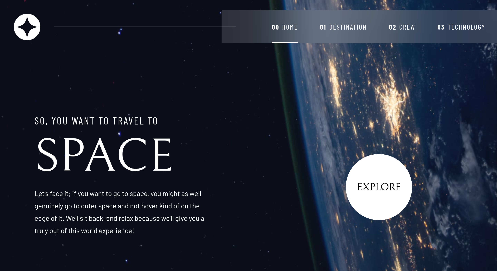

# Frontend Mentor - Space tourism website solution

This is a solution to the [Space tourism website challenge on Frontend Mentor](https://www.frontendmentor.io/challenges/space-tourism-multipage-website-gRWj1URZ3). Frontend Mentor challenges help you improve your coding skills by building realistic projects.

## Table of contents

- [Overview](#overview)
  - [The challenge](#the-challenge)
  - [Screenshot](#screenshot)
  - [Links](#links)
- [My process](#my-process)
  - [Built with](#built-with)
  - [What I learned](#what-i-learned)
- [Author](#author)

## Overview

### The challenge

Users should be able to:

- View the optimal layout for each of the website's pages depending on their device's screen size
- See hover states for all interactive elements on the page
- View each page and be able to toggle between the tabs to see new information

### Screenshot

### Links

- Solution URL: [GitHub Repo](https://github.com/mkhantk/space-tourism-website)
- Live Site URL: [Live](https://space-tourism-website-beta-sage.vercel.app/)

## My process

### Built with

- Semantic HTML5 markup
- CSS custom properties
- Flexbox
- Mobile-first workflow
- Tailwind CSS
- [React](https://reactjs.org/) - JS library
- Redux with Redux toolkit
- React Router

### What I learned

Well, I've learned a lot, I planned to use redux here because, I was learning the usage of redux in a practical way. I find it easy coming from the useContext/useReducer combo although there is only a little of state management in this project. Anyway, I think this is the best way to level up your skills, by doing projects. Well, I got to read a lot of doc but in the end, it work out well. I do appreciate the figma files provided for the design.

## Author

- Frontend Mentor - [@mkhantk](https://www.frontendmentor.io/profile/mkhantk)
